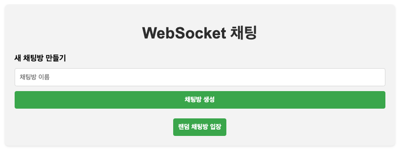
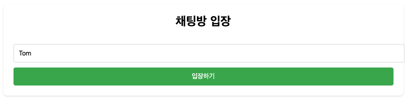
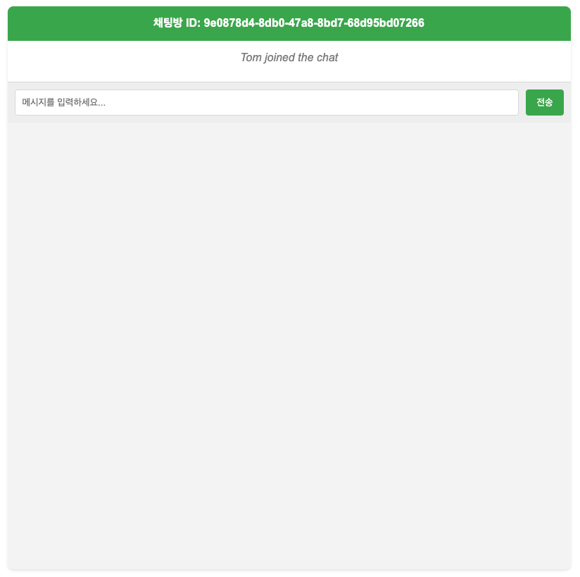
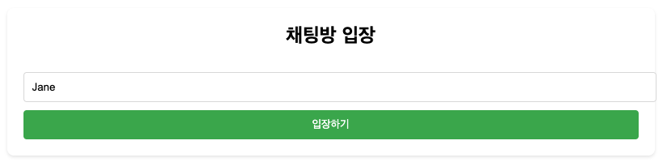
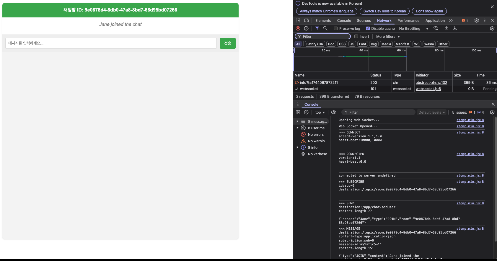
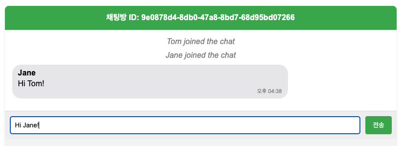
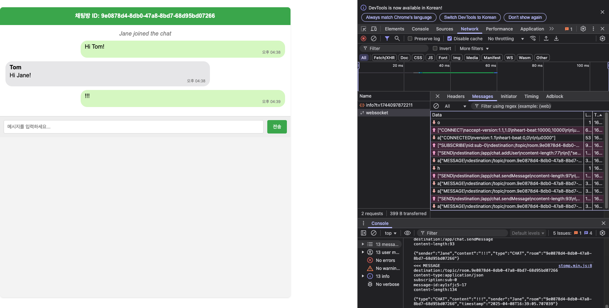

# Spring으로 WebSocket 구현

<br/>

## 동작 방법
http://localhost:8080 접속

<br/>

## 기술 스택
- Spring Boot 3.2.x 
- Java 21
- Gradle
- Lombok (보일러플레이트 코드 감소)
- WebSocket with STOMP (메시징 프로토콜)

<br/>

## 제공하는 기능
1. 실시간 채팅
2. 다중 채팅방 지원
3. 사용자 입장/퇴장 알림
4. 타임스탬프가 포함된 메시지
5. 자동 채팅방 정리 (모든 사용자가 나가면 채팅방 삭제)

## WebSocket 구현의 주요 특징
1. STOMP 프로토콜 사용: WebSocket 위에서 작동하는 메시징 프로토콜을 사용하여 구조화된 메시지 교환이 가능합니다.
2. SockJS: WebSocket을 지원하지 않는 브라우저를 위한 폴백 옵션을 제공합니다.

## WebSocket 서버 사용 방법
1. WebSocket 연결: ws://localhost:8080/ws
2. 메시지 발행: /app/chat.sendMessage
3. 메시지 구독: /topic/public

## 서버를 실행하면 클라이언트는 다음과 같이 연결할 수 있습니다.
1. WebSocket 연결: ws://localhost:8080/ws
2. 채팅방 구독: /topic/room.{roomId}
3. 메시지 전송: /app/chat.sendMessage
4. 사용자 입장: /app/chat.addUser

클라이언트에서는 STOMP.js나 SockJS 클라이언트를 사용하여 연결할 수 있습니다. 예를 들어, JavaScript에서는 다음과 같이 연결할 수 있습니다.
```javascript
const socket = new SockJS('http://localhost:8080/ws');
const stompClient = Stomp.over(socket);

stompClient.connect({}, function(frame) {
    console.log('Connected: ' + frame);
    stompClient.subscribe('/topic/public', function(message) {
        // 메시지 처리
    });
});

// 메시지 전송
stompClient.send("/app/chat.sendMessage", {}, JSON.stringify({
    type: 'CHAT',
    content: 'Hello!',
    sender: 'User1',
    room: 'public'
}));
```

<br/>

## 실행 화면

새 채팅방 만들기



"Tom"이 채팅방 입장




"Jane"이 채팅방 입장




"Tom"이 보는 채팅창 화면



"Jane"이 보는 채팅창 화면

