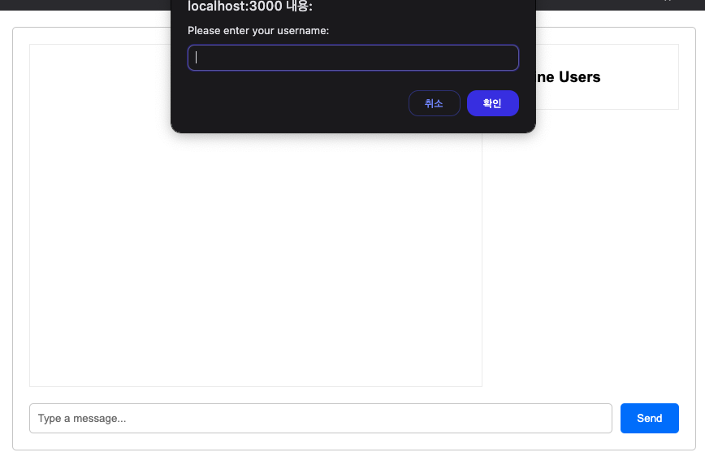
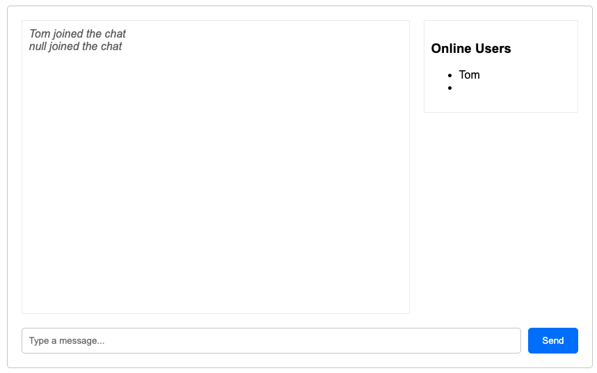
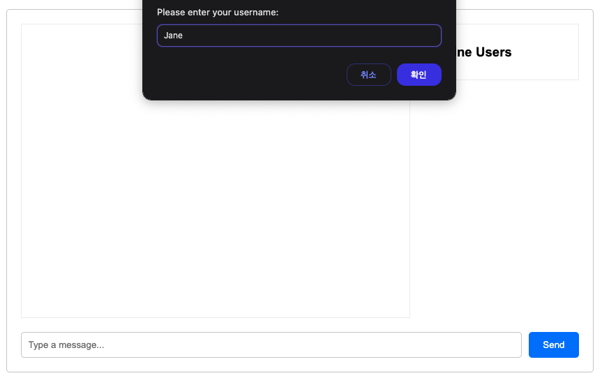
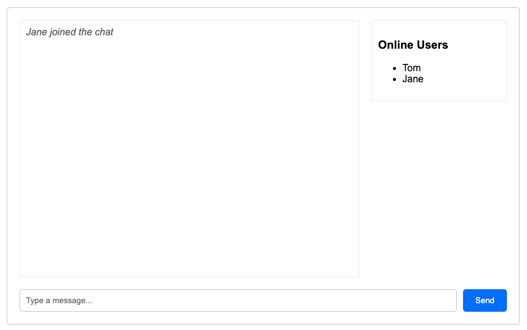
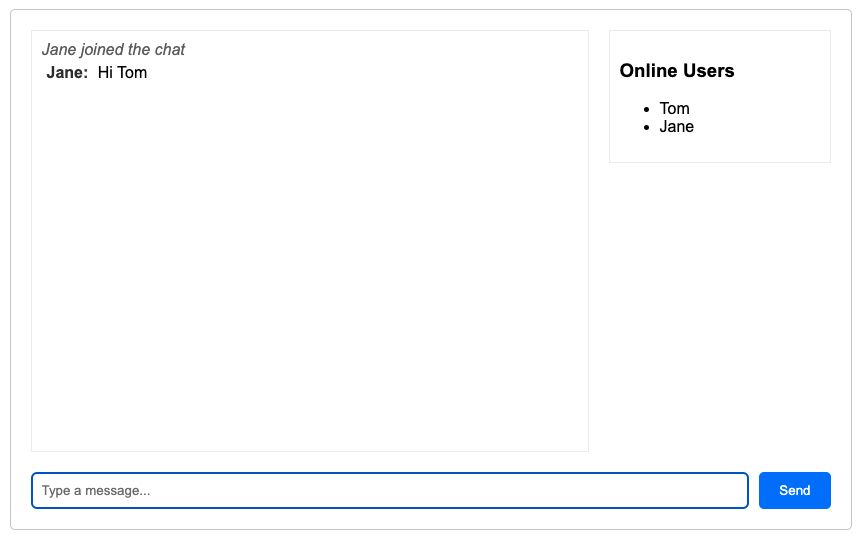
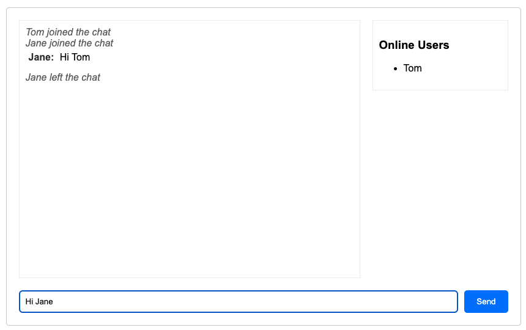

# NodeJS로 구현한 WebSocket

## 실행방법
`npm i`
`npm start`

## 화면
User - "Tom"




<br/>

User - "Jane"




<br/>

Chatting - "Tom & Jane"




## 로그 예시
```bash
> websocket-chat@1.0.0 start
> node server.js

Server is running on port 3000
a user connected
user disconnected
a user connected
a user connected
user disconnected
user disconnected
```